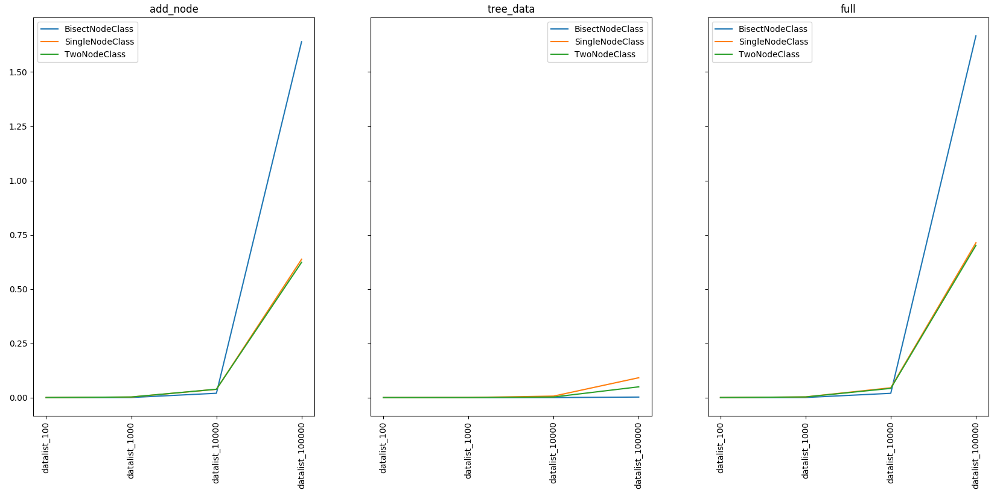

Binary Tree (sorting)
=====================

Current realization based on tree sort.
Our algorithms can do 2 simple abstract things - add new elem and return sorted container
So, below i realized and compare different approaches to implementation

.. contents:: :local:

Functions describes
-------------------

.. automodule:: binary_tree.funcs
    :inherited-members:

Data describes
--------------

.. automodule:: binary_tree.data
    :inherited-members:

Performance result
------------------

