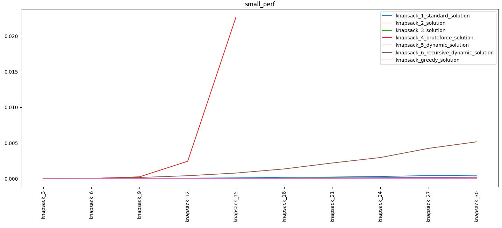

Knapsack problem
================

Some Theory:

The knapsack problem or rucksack problem is a problem in combinatorial optimization.

Given a set of items, each with a weight and a value, determine the number 
of each item to include in a collection so that the total weight is less 
than or equal to a given limit and the total value is as large as possible.

It derives its name from the problem faced by someone, 
who is constrained by a fixed-size knapsack and must fill it with the most valuable items.

`more here: <https://en.wikipedia.org/wiki/Knapsack_problem/>`_

.. contents:: :local:

Abstract module
---------------
.. automodule:: knapsack_problem.ref_func
    :members:

Solutions module
----------------
.. automodule:: knapsack_problem.funcs
    :inherited-members:

Data describes
--------------

.. automodule:: knapsack_problem.data
    :inherited-members:

Performance result
------------------

Common result
~~~~~~~~~~~~~

Accurate result
~~~~~~~~~~~~~~~
.. figure:: ../../knapsack_problem/result2.png
   :scale: 50 %
   :alt: map to buried treasure